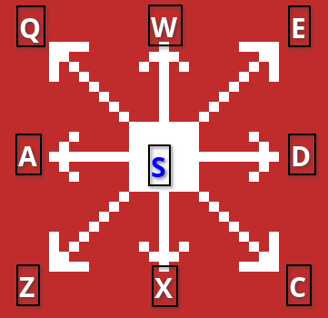

# baddies

baddies is a simple traditional grid like game for the terminal. It has movement, monsters, overhead view, and walls comparable to traditional roguelikes such as NetHack.

This game was originally made as a project at UIC, Fall 2023. I plan to flesh it out more into my own game that can possibly become more detailed with some unique ideas.

## Installation

For Windows users:

Install the correct binary executable for your machine on the [Releases](https://github.com/jera1470/baddies/releases/tag/baddies_v0.1) page.

For Linux and macOS users:

Install the executable from the [Releases](https://github.com/jera1470/baddies/releases/tag/baddies_v0.1) page and run in on your terminal:

```bash
./baddies
```

## Usage

Use the movement keys as follows:



The goal is to get the exit of the dungeon (represented by a *).

## Roadmap:
- Make a new story
- Add in items, such as weapons and armor
- Add in new monsters, like goblins, dragons, etc.
- and more!

## License

[GNU v3.0](https://www.gnu.org/licenses/gpl-3.0.en.html)
